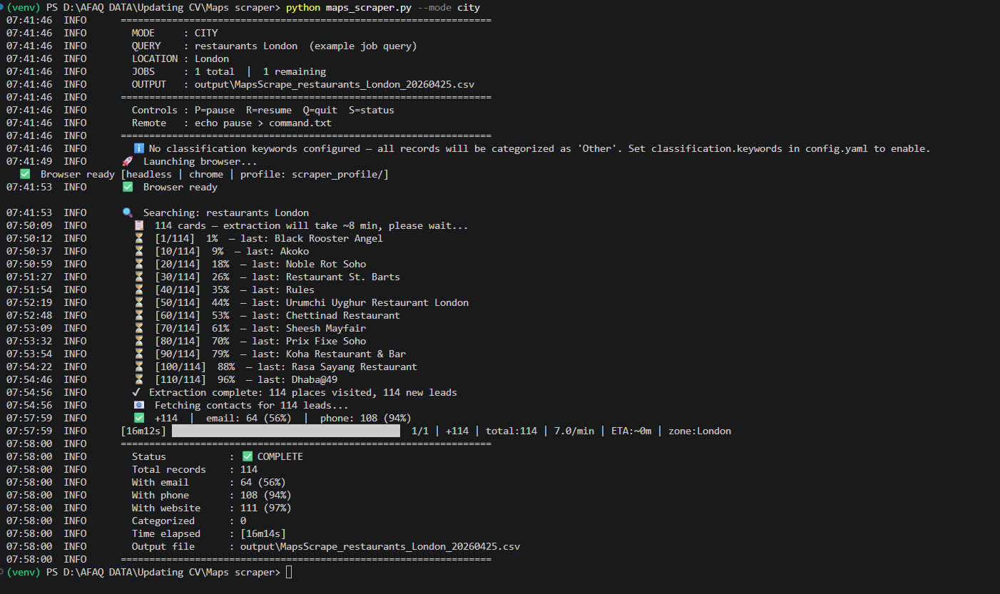
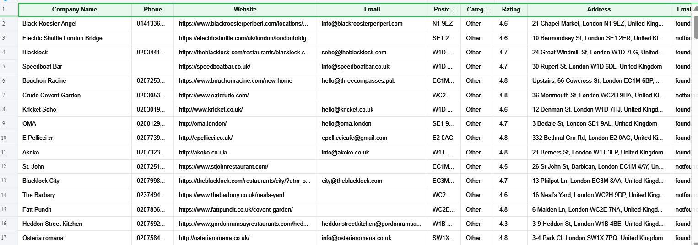

# Google Maps Business Scraper

**Production-grade Python scraper — extracts thousands of B2B leads from Google Maps and enriches each one with email, phone, and website contact data from the business's own website. Outputs a clean, deduplicated Excel file ready for outreach campaigns.**

> **⚠️ Not a review or rating scraper.** This tool extracts *business contact data* — email, phone, website, postcode — from Google Maps search results for B2B lead generation. If you need Google reviews, star ratings, or Q&A data, this is the wrong repo.

[](https://github.com/FAAQJAVED/Google-Maps-Business-Scraper/actions/workflows/ci.yml)
[](https://www.python.org/)
[](LICENSE)
[](tests/)
[](https://github.com/FAAQJAVED/Google-Maps-Business-Scraper)

> Found this useful? A ⭐ on GitHub helps other developers find it.

---

## Table of Contents

- [Preview](#preview)
- [What It Does](#what-it-does)
- [Use Cases](#use-cases)
- [How It Works](#how-it-works)
- [Features](#features)
- [Performance](#performance)
- [What Data You Get](#what-data-you-get)
- [Quick Start](#quick-start)
- [Mega Mode](#mega-mode----getting-10-50-more-results)
- [Configuration](#configuration)
- [CLI Reference](#cli-reference)
- [Runtime Controls](#runtime-controls)
- [Output](#output)
- [Tech Stack](#tech-stack)
- [Project Structure](#project-structure)
- [Running Tests](#running-tests)
- [Requirements](#requirements)
- [Troubleshooting](#troubleshooting)
- [Deduplication Tool](#deduplication-tool)
- [B2B Lead Toolkit](#part-of-the-b2b-lead-toolkit)
- [Disclaimer](#disclaimer)
- [License](#license)

---

## Preview

| Terminal — live progress | Excel Output |
|---|---|
|  |  |

---

## What It Does

1. **Scrapes Google Maps** for any search query in any city — property managers, dentists, solicitors, restaurants, accountants — anything with a Google Maps presence.
2. **Enriches each result** by visiting the business's own website to extract email addresses and phone numbers using a hybrid HTTP + Playwright pipeline.
3. **Deduplicates** across multiple runs using Name + Address as the composite key.
4. **Saves to Excel** — a styled Data sheet plus a Summary sheet with coverage statistics.

It uses Playwright headless Chromium to navigate Maps and extract JavaScript-rendered listing data directly from the DOM, while a parallel HTTP thread pool fetches business websites up to 15× faster than browser navigation. All configuration — query, city, output format, enrichment rules — lives in `config.yaml`. Zero Google-specific strings exist in the Python code.

---

## Use Cases

| Who uses it | What they do | Example query |
|---|---|---|
| **Sales teams** | Build targeted prospect lists for cold outreach | `"property managers london"` → 300+ verified contacts |
| **Marketing agencies** | Deliver structured lead data for any UK or EU sector | `"dentists manchester"` → email + phone for every listing |
| **Market researchers** | Map an entire service category across a region | `"solicitors edinburgh"` → trust score + coverage stats |
| **CRM admins** | Enrich and validate existing contact records | Any query → output merges with existing Excel databases |
| **Recruiters** | Identify hiring employers in a target geography | `"law firms birmingham"` → website + direct phone |
| **Freelance lead gen** | Run overnight scrapes and deliver clean Excel files | Mega mode → 2,000–5,000 results overnight, unattended |

---

## How It Works

```
┌─────────────────────────────────────────────────────────────────┐
│  BROWSER (Playwright + Chromium)                                │
│                                                                 │
│  config.yaml ──► Maps search URL ──► headless Chrome DOM       │
│                       │  JavaScript-rendered listing data       │
│                       ▼                                         │
│                  business_name, address, phone,                 │
│                  website_url, rating, category                  │
└──────────────────────────────┬──────────────────────────────────┘
                               │  website URLs extracted
┌──────────────────────────────▼──────────────────────────────────┐
│  HTTP ENRICHMENT LAYER (requests · 15 parallel threads)         │
│                                                                 │
│  website[] ──► Pass 1: HTTP GET homepage + contact pages       │
│                    │ Cloudflare XOR decode · regex extract      │
│                    │ Not found?                                  │
│                    ▼                                            │
│               Pass 2: Playwright headless fallback              │
│                    │ JS-rendered pages, SPAs, React frontends   │
│                    ▼                                            │
│               email · phone · postcode extracted                │
└──────────────────────────────┬──────────────────────────────────┘
                               │
┌──────────────────────────────▼──────────────────────────────────┐
│  OUTPUT                                                         │
│  Google_Maps_YYYYMMDD.xlsx  (Data sheet + Summary sheet)       │
│  Google_Maps_YYYYMMDD.log   (rotating, 5 MB, 3 backups)       │
└─────────────────────────────────────────────────────────────────┘
```

---

## Features

| Feature | Detail |
|---|---|
| **Playwright + CDP automation** | Headless Chromium reads JS-rendered Maps DOM directly — no brittle CSS selectors |
| **15-thread parallel enrichment** | Fetches all business websites concurrently — configurable thread count |
| **Dual-pass contact extraction** | Pass 1: fast HTTP GET · Pass 2: Playwright fallback for JS-rendered sites |
| **Cloudflare email decoding** | XOR-decodes `data-cfemail` and `/cdn-cgi/l/email-protection` attributes |
| **Mega mode** | One query per zone, unattended overnight run, 2,000–5,000+ results |
| **Checkpoint / resume** | Atomic saves after every page — re-run anytime to continue |
| **Deduplication tool** | Merge, dedup, and subtract across multiple Excel output files |
| **Cross-platform keyboard controls** | P pause · R resume · Q quit · S status |
| **Headless + login mode** | `headless: true` for unattended runs · `--login` for Google-authenticated sessions |
| **Config-driven** | Zero Google-specific strings in Python code — everything in `config.yaml` |

---

## Performance

Typical figures on a standard broadband connection (no proxy):

| Mode | Result set | Time |
|---|---|---|
| City | 60-120 results | 8-15 min |
| Mega (20 zones) | 500-900 results | 2-4 hours |
| Mega (100 zones) | 2000-5000 results | 8-20 hours |

Enrichment runs in parallel (15 threads by default). The biggest time cost is Maps extraction (~4-5 seconds per place), not enrichment.

> **Real run:** `"estate agents london"` — Mega mode, 80 zones, **3,847 companies**, 6h 12m. 3,201 with email (83%), 3,644 with phone (95%).

---

## What Data You Get

| Field | Example |
|---|---|
| Company Name | Foxtons Estate Agents |
| Email | lettings@foxtons.co.uk |
| Phone | 020 7893 6262 |
| Website | https://www.foxtons.co.uk |
| Postcode | W1U 4EE |
| Category | Real Estate Agency |
| Rating | 4.2 |
| Address | 110 Baker St, London |
| Email Status | found |
| Source | Google Maps |

See [`Assets/sample_output.csv`](Assets/sample_output.csv) for 10 rows of realistic sample output.

---

## Quick Start

### 1. Install dependencies

```bash
pip install playwright requests pyyaml openpyxl
playwright install chromium
```

Google Chrome installed on your machine is recommended over Playwright's built-in Chromium — it gets more results and avoids captchas more reliably.

### 2. Configure

Open `config.yaml` and fill in the two required fields:

```yaml
search:
  query: "dentists"            # ★ what to search for
  location: "Manchester"       # ★ city or area
```

For clean phone output, set your country's phone config (UK is pre-filled in `config.yaml`):

```yaml
phone:
  country_code: "44"
  valid_prefixes: ["011","012","013","014","015","016","017","018","019",
                   "020","021","022","023","024","028","029","030","033","07"]
  valid_lengths: [10, 11]
```

### 3. Run

```bash
# City mode — single query, ~60-120 results, good for testing
python maps_scraper.py --mode city

# Mega mode — one query per zone, 500-5000+ results, use overnight
python maps_scraper.py --mode mega
```

Results are saved to `output/MapsScrape_<query>_<location>_<date>.csv`.

---

## Mega Mode — getting 10-50× more results

Google Maps caps each individual search at roughly 60-120 results regardless of scroll depth. Mega mode works around this by running one search per postcode district (or zip code, or borough), then deduplicating everything:

```yaml
geography:
  region_zones:
    # London (UK) — postcode districts
    - "E1"
    - "EC1"
    - "N1"
    - "NW1"
    - "SE1"
    - "SW1"
    - "W1"
    - "WC1"

    # New York (US) — zip codes
    # - "10001"
    # - "10002"
    # - "10003"
    # - "10004"

    # Berlin (Germany) — PLZ
    # - "10115"
    # - "10117"
    # - "10119"
    # - "10178"
    # - "10179"
```

Run with:
```bash
python maps_scraper.py --mode mega
```

Use `--dry-run` first to see all the queries that will be executed.

---

## Configuration

All keys with their defaults:

| Key | Default | Description |
|---|---|---|
| `search.query` | *(required)* | What to search for |
| `search.location` | *(required)* | City or area |
| `phone.country_code` | `"44"` | Dialing code without + |
| `phone.valid_prefixes` | `[see config]` | Accepted local prefixes |
| `phone.valid_lengths` | `[10, 11]` | Accepted digit counts |
| `phone.preferred_prefix` | `""` | Prefer this prefix if multiple phones found |

Common country phone configs:

| Country | `country_code` | `valid_lengths` | `valid_prefixes` |
|---|---|---|---|
| UK | `"44"` | `[10, 11]` | `["01","02","03","07"]` (see config for full list) |
| US | `"1"` | `[10]` | `[]` (accept all — filter by length) |
| Germany | `"49"` | `[10, 11, 12]` | `["015","016","017","030","040","089"]` |
| Australia | `"61"` | `[9, 10]` | `["02","03","04","07","08"]` |
| France | `"33"` | `[9, 10]` | `["01","02","03","04","05","06","07","09"]` |
| `geography.lat_min/max/lng_min/max` | `0.0` | Bounding box (0 = disabled) |
| `geography.region_zones` | `[]` | Zone list for mega mode |
| `geography.valid_postcode_prefixes` | `[]` | Postcode whitelist |
| `classification.keywords` | `{}` | Category labels and keyword lists |
| `performance.headless` | `true` | Invisible browser (faster) |
| `performance.browser_channel` | `"chrome"` | `"chrome"` or `"chromium"` |
| `performance.scroll_pause` | `1.5` | Seconds between scroll actions |
| `performance.slow_connection_wait` | `25` | Seconds to wait per stall |
| `performance.max_stalls` | `5` | Stall periods before end-of-results |
| `performance.fetch_threads` | `15` | Parallel enrichment workers |
| `performance.browser_restart_every` | `300` | Zones between browser restarts |
| `scheduling.stop_at` | `null` | Auto-stop at HH:MM (24-hour, zero-padded) |
| `scheduling.disk_min_mb` | `500` | Pause if disk space below this (MB) |
| `output.format` | `"csv"` | `"csv"` or `"excel"` |
| `output.directory` | `"output"` | Output folder (auto-created) |
| `stealth.proxies` | `[]` | Proxy list — see `docs/proxy_guide.md` |
| `stealth.rotate_every` | `10` | Rotate proxy every N queries (0 = on failure only) |
| `captcha.human_solve` | `true` | Pause on captcha for manual solve |

---

## CLI Reference

| Flag | Description |
|---|---|
| `--mode city` | Single-query search (default) |
| `--mode mega` | One query per zone — massively more results |
| `--config PATH` | Use a different config file |
| `--fresh` | Clear checkpoint, start from scratch |
| `--login` | Open browser visibly to sign in to Google before scraping |
| `--dry-run` | Preview all job queries without opening a browser |
| `--stats` | Print statistics from the existing output file |

---

## Runtime Controls

While the scraper is running you can control it without stopping it:

| Action | Keyboard | File |
|---|---|---|
| Pause | `P` | `echo pause > command.txt` |
| Resume | `R` | `echo resume > command.txt` |
| Quit cleanly | `Q` | `echo stop > command.txt` |
| Status | `S` | — |

The scraper saves a checkpoint after every completed zone. If you stop it (or it crashes), just re-run the same command to resume from where it left off.

---

## Output

### Data sheet columns

| Column | Description |
|---|---|
| Company Name | Business trading name (pipe-suffixes stripped) |
| Phone | Cleaned local number (country code stripped) |
| Email | Contact email from the business's website |
| Website | Website URL from the Maps listing |
| Postcode | Extracted from address |
| Category | Keyword-classified label (or "Other") |
| Rating | Google Maps star rating |
| Address | Full address string |
| Email Status | `found` or `notfound` |
| Phone Status | `found` or `notfound` |
| Source | Always `Google Maps` |

### Log files

Rotating log files are written to the `logs/` directory. Each log file is capped at 5 MB with 3 rolling backups. Log entries include per-place extraction results, enrichment errors, and checkpoint events.

---

## Headless mode and detection

**`headless: true` is the recommended setting** (and the default). Contrary to a common assumption, headless Chrome is *not* more likely to be detected and blocked by Google Maps. The scraper:

- Removes the `navigator.webdriver` flag via an init script
- Disables the automation banner (`--disable-blink-features=AutomationControlled`)
- Rotates User-Agent strings across 7 real browser fingerprints
- Rotates viewport sizes
- Blocks tracking/analytics resources to reduce load time

The only reason to run with `headless: false` is debugging, or the `--login` flow.

### Google sign-in (`--login` flag)

Signing in to a real Google account before scraping significantly increases results per zone and nearly eliminates captchas:

```bash
python maps_scraper.py --mode mega --login
```

The browser opens visibly, you sign in once, press Enter, then it runs headlessly in the background for the rest of the session. Your login is saved to `scraper_profile/` for future runs.

---

## Tech Stack

| Library | Purpose |
|---|---|
| `playwright` | Headless Chromium — navigates Maps, reads JS-rendered DOM |
| `requests` | Parallel HTTP enrichment of business websites |
| `openpyxl` | Writes styled Excel output with Data and Summary sheets |
| `pyyaml` | YAML config loading |
| `tqdm` | Live terminal progress bar with ETA |
| `python-dotenv` | Optional — loads proxy settings from `.env` file |

---

## Project Structure

```
maps_scraper.py          # entry point
dedupe_tool.py           # standalone deduplication / merge / subtract tool
config.yaml              # all configuration
scraper/
  browser.py             # Playwright browser lifecycle, proxy rotation, captcha
  config.py              # config loading, deep-merge, validation
  controls.py            # P/R/Q/S keyboard controls + command.txt
  extractor.py           # scroll, extract_place, enrich_batch
  filters.py             # geographic filter, dedup, classification
  storage.py             # CSV/Excel output, checkpoint, done-queries log
  utils.py               # phone cleaning, disk check, stop_at, beep, backoff
tests/
  test_scraper.py        # 122 unit tests, all pure-function (no browser needed)
docs/
  proxy_guide.md         # proxy setup and formatting
output/                  # results saved here (auto-created)
logs/                    # rotating log files (auto-created)
```

---

## Running Tests

```bash
pip install pytest
pytest tests/ -v
```

All tests are pure-function and run in under 3 seconds with no browser or internet required.

---

## Requirements

- Python 3.10+
- See `requirements.txt` for full list
- Google Chrome installed (optional but recommended over Playwright Chromium)

---

## Troubleshooting

**Getting fewer results than expected?**
Increase `max_stalls` in `config.yaml` (try 7-8) and `slow_connection_wait` to 35. Large result sets on slow connections can stall between card batches.

**Phone numbers look wrong (missing leading zero, or have country code)?**
Set `phone.country_code: "44"` and `phone.valid_lengths: [10, 11]` in `config.yaml`.

**Browser won't launch?**
Set `browser_channel: "chromium"` in `config.yaml` to use Playwright's built-in browser instead of Google Chrome.

**Captcha appearing frequently?**
Use the `--login` flag to sign in to a Google account. Authenticated sessions almost never hit captchas.

**Email column shows agency emails across multiple businesses?**
Add the agency domain to `filters.junk_email_domains` in `config.yaml`.

**Running outside the UK?**
Set `phone.country_code` to your country's dialing code and update `valid_prefixes` and `valid_lengths` accordingly. See the phone config table above for common country examples.

**Email column empty for most results?**
The business website may be blocking automated requests. Try reducing `fetch_threads` to `5` and adding a longer `slow_connection_wait` in `config.yaml`. Playwright Pass 2 handles the remaining sites automatically.

**Playwright not found after pip install?**
Run `playwright install chromium` separately. Playwright requires a one-time browser binary download that `pip install` alone does not trigger.

---

## Enrichment Pipeline

This release ships four targeted improvements to the website contact-enrichment pipeline:

### Fast-fail on domain-level errors

Previously, when a business website was completely unreachable (dead SSL certificate, connection reset, or connect timeout), the scraper continued trying all 7 additional subpaths (`/contact`, `/about`, etc.), wasting up to 32 seconds per domain.

The enricher now classifies every fetch failure:

- **Connection-level errors** (SSL, ConnectionReset, ConnectTimeout): the entire domain is bailed immediately — subpaths are guaranteed to fail identically.
- **Read timeouts**: one further attempt is allowed (a later path may succeed, as confirmed in testing). If a second consecutive read timeout occurs, the domain is bailed.
- **4xx status codes**: treated as "path not found" — the loop continues to the next path normally.

Typical saving: 8–32 seconds per unreachable domain, which adds up significantly on large overnight runs.

### Cloudflare email decoder (Stage 0)

Many UK and EU business websites use Cloudflare's email-protection feature. Cloudflare replaces every `mailto:` link in the HTML with an XOR-encoded `data-cfemail="…"` attribute (or a `/cdn-cgi/l/email-protection#…` href), making the email address invisible to all plain-text extraction methods.

A new Stage 0 decodes these XOR-encoded addresses *before* the existing four plain-text stages run, recovering real email addresses from Cloudflare-protected sites that previously returned `email: ✗` even on successful page loads.

The email pipeline is now a 5-stage pipeline:

| Stage | Source | Signal |
|---|---|---|
| 0 | Cloudflare XOR (`data-cfemail`, `cdn-cgi` hrefs) | Very high |
| 1 | `mailto:` hrefs | High |
| 2 | `data-email` attributes (WordPress/Elementor) | High |
| 3 | `[at]`/`(at)` obfuscation variants | Medium |
| 4 | Plain regex on entity-decoded HTML | Low |

### Smart contact page discovery

The hardcoded contact-path list (`/contact`, `/about`, etc.) misses custom slugs common on UK business sites: `/talk-to-us`, `/reach-us`, `/find-us`, `/enquire`, `/get-a-quote`, and others.

After fetching the homepage, the enricher now scans all `<a>` links for hrefs or anchor text that contain contact-related keywords. Up to 3 candidate same-domain URLs are tried as additional contact pages, using the same fast-fail error classification as the main loop.

Keywords scanned: `contact`, `about`, `enquir`, `get-in-touch`, `reach`, `talk`, `find-us`, `our-team`, `team`, `staff`, `office`, `location`, `directions`, `visit`, `meet`.

### Aggregator URL sanitization

Google Maps occasionally stores a review-aggregator URL as a business's website — for example `https://www.deskjock.reviews/manlets.com/top5`, where the real business domain is embedded in the path. The scraper would previously spend ~32 seconds attempting 8 paths on the dead aggregator.

The sanitizer detects this pattern at the start of `enrich_one()` and rewrites the URL to the real embedded domain (`https://manlets.com`) before any fetch is attempted.

---

## Deduplication Tool

`dedupe_tool.py` is a standalone utility for merging, deduplicating, and comparing scraper output files. It works with both `.csv` and `.xlsx` inputs.

```bash
# Merge and deduplicate multiple files
python dedupe_tool.py output/file1.csv output/file2.csv

# With a custom output path
python dedupe_tool.py file1.csv file2.csv --output merged_clean.csv

# Subtract a known list (e.g. remove existing clients from a new leads file)
python dedupe_tool.py map_list.csv --subtract existing_clients.csv

# Use a custom dedup key (default is Name + Address)
python dedupe_tool.py file1.csv file2.csv --key "Name,Phone"
```

**Dedup key** — the `--key` flag specifies which columns identify a unique record. Values are lowercased and whitespace-normalised before comparison, so `"Acme Ltd "` and `"acme ltd"` are treated as the same record.

**Subtract mode** (`--subtract`) — loads a second file and removes any rows from the merged output whose key matches a row in the subtract file. Useful for removing overlap between a freshly scraped list and a block-management or existing-client list.

The output is always a UTF-8 CSV saved to `output/merged_YYYYMMDD_HHMMSS.csv` by default, or to the path given by `--output`.

---

## Part of the B2B Lead Toolkit

This scraper is one component of a broader B2B lead generation pipeline targeting UK property management companies, letting agents, block managers, and HMO landlords.

| Repo | What it does |
|---|---|
| **[Google Maps Business Scraper](https://github.com/FAAQJAVED/Google-Maps-Business-Scraper)** ← *you are here* | Extracts and enriches business listings from Google Maps |
| **[Email Phone Enrichment Tool](https://github.com/FAAQJAVED/Email-Phone-Number-Enrichment-Tool)** | Scrapes contact emails and phones from company websites |
| **[Leadhunter Pro](https://github.com/FAAQJAVED/Leadhunter_Pro)** | Multi-engine search scraper with HOT/WARM/COLD lead scoring |
| **[Trustpilot Business Scraper](https://github.com/FAAQJAVED/trustpilot-business-scraper)** | Extracts business listings from Trustpilot search results |
| **[JSON Directory Harvester](https://github.com/FAAQJAVED/json-directory-harvester)** | Configurable harvester for any JSON directory API with geo-filtering |

All five tools share the same Excel output schema (Data + Summary sheets) — results can be combined directly in Excel or imported together into a CRM.

---

## Disclaimer

This tool is for personal research and lead generation only. Check Google's Terms of Service before use. Rate-limit your requests using `scroll_pause` and `request_delay` to be respectful of their infrastructure.

---

## License

MIT © 2026 [FAAQJAVED](https://github.com/FAAQJAVED) — see [LICENSE](LICENSE)
